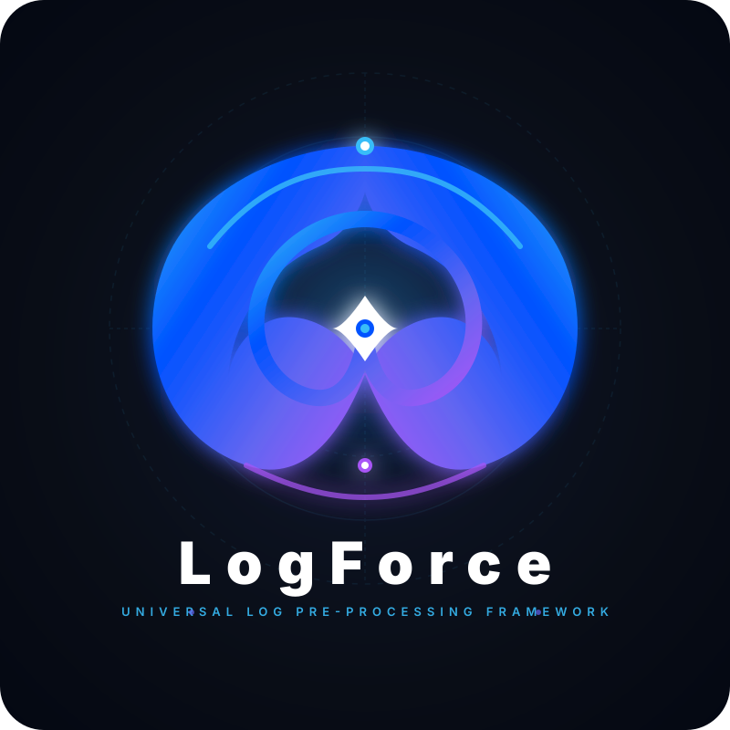

# Status: Prototype


[](https://www.apache.org/licenses/LICENSE-2.0)

> [!NOTE]
> Prototype for evaluation. Core pipeline is ready for offline demos while device agents and scale out remain in design.

# ULPF

Universal Log Pre Processing Framework provides a fast offline pipeline that normalizes heterogeneous perimeter logs to OCSF 4001. It keeps raw bytes, hashes the canonical form, and makes every event searchable for SIEM and ML. Teams can add a new firewall with one regex and run the whole stack air gapped with a single compose file.

Introduction
------------

ULPF is an open source log pre processing framework built in house for perimeter visibility. It ingests raw syslog, CEF, LEEF, JSON and vendor key value formats, normalizes them with Vector and VRL, classifies with a local ONNX model, and lands everything as Hive partitioned NDJSON and Postgres GIN.

ULPF use cases:

* **Perimeter Log Normalization With Open Source Stack**

ULPF can centralize logs from Palo Alto, Cisco ASA, FortiGate, Suricata and Zeek into one OCSF schema without losing raw.

* **Lossless Forensics and Search**

Every normalized event keeps `integrity.hash` and `unmapped.raw_event` so analysts can verify and rehydrate the original line.

* **Offline Edge Classification**

The Go API classifies with a quantized 23 MB ONNX model in about 5 ms per log and falls back to a keyword mock if the model is missing, so demos never fail.

For more introduction, visit: [System Design](docs/SYSTEM_DESIGN.md).

For evaluation, visit: [Evaluation](docs/EVALUATION.md), [Setup](docs/SETUP.md) and [Architecture 2Page](docs/ARCHITECTURE_2PAGE.md).

Installation
------------

To run the prototype locally, visit: [Quickstart](docs/SYSTEM_DESIGN.md#how-to-run).

For setup instructions, visit: [Setup](docs/SETUP.md).

Quickstart:

```bash
go run ./ui/server.go
open http://localhost:8081/dashboard.html
```

How to contribute
-----------------

If you wish to contribute to ULPF, first read: [Contributing Guide](CONTRIBUTING.md).

#### Code of Conduct

ULPF has adopted a Code of Conduct that is to be honored by everyone who participates formally or informally. Please read the full text: [Code of Conduct](CODE_OF_CONDUCT.md)

####

All notable changes are documented in: [CHANGELOG](CHANGELOG.md)

ULPF UI
-------------

To learn more about the ULPF dashboard, visit: [System Architecture](docs/SYSTEM_ARCHITECTURE.md).

There you will find guides on:

* [Adding a new dashboard panel](docs/SYSTEM_DESIGN.md)
* [Submitting ingest configurations](ingestion/vector.toml)
* [Importing a VRL rule](ingestion/transforms/normalize_perimeter.vrl)
* [Releasing configurations](docs/SYSTEM_ARCHITECTURE.md)
* [Testing configurations](tests/test_normalize_perimeter.yaml)
* [Testing release](docs/SYSTEM_DESIGN.md)
* [Adding links to the homepage](ui/dashboard.html)
* [Setting up health checks](ui/server.go)
* [Modifying the layout](ui/dashboard.html)
* [Managing models](models/README.md)
* [Use offline bundle file](docs/offline-bundle.md)
* [Filter and save searches](parsing/ulpf_ocsf.py)

Services
---------

To explore ULPF services, visit: [Ingestion](ingestion/vector.toml) and [Parsing](parsing/ulpf_ocsf.py).

There you will find guides on:

* [Setting up a service in ingestion](ingestion/vector.toml)
* [Ingestion service](ingestion/vector.toml)
* [Parsing service](parsing/ulpf_ocsf.py)
  * [Setting up ASA parsing](parsing/decoders/perimeter.yml)
* [Storage writer service](storage/parquet_writer.py)
  * [Setting up Hive writer](storage/parquet_writer.py)
* [Classification service](ui/server.go)
  * [Managing ONNX models](models/README.md)

Deployment
----------

To deploy the prototype, refer to: [System Architecture](docs/SYSTEM_ARCHITECTURE.md#deployment-view).

For evaluation, visit: [Evaluation](docs/EVALUATION.md) and [Architecture 2Page](docs/ARCHITECTURE_2PAGE.md).

You will find guides on:

* Running with Docker Compose
* Offline bundling with SHA256SUMS
* Wiring Vector to Postgres and Hive
