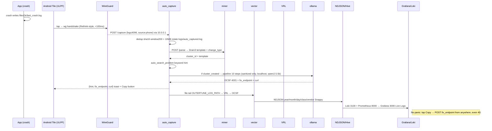

# ULPF, Architecture Document (Max 2 Pages)


---

## Page 1, Strategy, High-Level, Sequence, Tiers

### 1. Strategy

Modular monolith + Vector 0.38/VRL ingestion + Go ONNX edge classifier for the **perimeter slice** (today); thin device agents + WireGuard `10.0.0.0/24` to an **Azure free VM pod** where Drain3 + `qwen2.5.5b` decode to fix, for the **universal fleet** (next). Constraints driving every choice: air-gapped single binary (`models/ 58M baked: onnx 215K+onnx_data 22M+2_Dense 1.5M+libonnx 34M`), budget ~5 ms warm (`server.go 389ms cold → ~5ms`), raw never lost (`sha256(trim(raw))` + `unmapped.raw_event`), one-regex device onboarding (`VRL only`), one `docker compose` bring-up, `when_full=block` not drop (`vector.toml`).

**ONNX placement rule:** 23 MB `int8` `42 leaves ~5ms` runs **on pod/edge**, never on phone (`libonnxruntime 34M, no NNAPI` `Prd.md`). Phone is a thin capturer (`POST /capture ≤4096 + sha16 window200` `capture.py,24-37`).

### 2. High-Level Architecture

```text
 Devices (auto-capture, no paste per app)
 ┌──────────────┬──────────────┬──────────────┬──────────────┐
 │ Laptop │ Phone (Android/iOS)│ Server │ Firewall/IDS │
 │ Win/macOS/ │ logcat/crash │ journald │ Palo/ASA/ │
 │ Linux agent │ Sysdiagnose │ File tail│ Forti/Suricata│
 └──────┬───────┴──────┬───────┴──────┬─────┴──────┬───────┘
 │ │ POST /capture 4096 cap │ Vector tail (already)
 │ │ /image 10MB /launch │ PERIMETER_LOG_PATH
 ▼ ▼ ▼ ▼
 └──────────────┴──────┬───────┴──────────────┘
 │ WireGuard VPN (Rethink-style)
 │ 10.0.0.0/24, anywhere, no public port
 ▼
 ┌─────────────────────┐
 │ VM Pod (Azure free) │ B1s 1GB / B1ms 2GB via Student Pack
 │ auto_capture │ 10MB rotate + dedup sha16
 │ miner │ Drain3 POST /parse
 │ vector.38 │ file→VRL→OCSF 4001
 │ ollama │ qwen2.5.5b 0.52GB (or 1b/2b/3.8b)
 │ loki/prom/grafana │ + node-exporter
 └──────────┬──────────┘
 │ NDJSON
 ▼
 ┌─────────────────────┐
 │ Edge Classifier │ Go (also on pod)
 │ WordPiece 128 │ ONNX int8 23MB still on pod
 │ 42 leaves / 1024d │ (phone never runs ONNX)
 │ /api/classify │
 └──────┬──────────────┘
 │
 ┌────────────┼────────────┐
 ▼ ▼ ▼
 ┌──────────────────┐ ┌──────────┐ ┌──────────────────┐
 │ Storage Lake │ │ Dashboard│ │ Decode → Fix │
 │ NDJSON + Hive │ │ Live KPI │ │ what/why/severity│
 │ Parquet Snappy │ │ 2→3 live │ │ fix_endpoint+cURL│
 │ DataFusion prune │ │ Grafana │ │ toast + deep link│
 └────────┬─────────┘ └──────────┘ └──────────────────┘
 │ also mirrors
 ▼
 ┌──────────────────┐
 │ Postgres 16 │─→ /api/stats, /api/query pg_count
 │ events GIN raw │
 └──────────────────┘
 ┌──────────────────┐
 │ Search Indexer │ ulpf_ocsf.py + perimeter.yml (5)
 └──────────────────┘
```

### Sequence, midnight crash caught & fixed from a hostel



### 3. Device Tier, Auto-Catch (no paste per app)

| Device | Agent / install | Auto-detect signal | Manual step |
|---|---|---|---|
| Windows | Win service | ETW/EventLog per app auto tag | install once |
| macOS | launchd daemon | `~/Library/Logs/DiagnosticReports/*.ips` + `log stream` | install once |
| Linux | systemd `journald` tail | `journalctl -f` `SYSLOG_IDENTIFIER=` | `Vector include` |
| Android | APK `TileService` + crash handler | `logcat -t 500` via Shizuku else `filesDir/last_crash.log`, `packageName → source` | tap tile |
| iOS | Shortcuts + Share Extension | `os_log` + `sysdiagnose` share → `POST /capture` | share → ULPF |
| Firewall/Server | Vector (already) | header/prefix Phase 1 regex (`OuterTune:`, `%ASA-`, `CEF:`) | tail file |

Per-app detection is one fingerprint string in `normalize_outertune.vrl` / `sampler.py`, no new agent.

### 4. Frontend, Prototype UI + Future Tile

**Today (`perimeter/ui`):** `dashboard.html 1270L` single file (Tailwind CDN, `file://` + served), format `?format=` selector, drag file → `POST /api/classify` → chips + Canonical NDJSON + Copy/Download, auto `POST /api/ingest` → `GET /api/stats` live KPI, `POST /api/query` prune, 30s health badge warm/mock.

**Future tile (screenshot target):** new QS row `[ Refresh Connection | ULPF ]` beside Rethink/Orbot. Kotlin `TileService BIND_QUICK_SETTINGS_TILE` `onClick() → STATE_ACTIVE → IO{postToVm(logcatTail)} → toast(hint+fix) → INACTIVE` (`docs/PHONE_TILE.md`). `VpnService` routes only `10.0.0.0/24` (unlike Rethink `0.0.0.0/0`).

### 5. Backend, Perimeter Go + Pod Auto-Capture

**Go `ui/server.go` (also on pod):**

| Handler | Notes, `server.go:line` |
|---|---|
| `handleHealth` | warms ORT, `latencyMs`, `136-152` |
| `handleClassify` | `ClassifyBatch`, `X-Latency-Ms`, 503 mock, `154-202` |
| `handleIngest` | `?format→vendor`, 10 MB scanner, `MkdirAll`, PG `raw::jsonb`, `214-288` |
| `handleQuery` | `4001` substring prune + `pg_count` cap 200, `290-396` |
| `handleStats` | 12×2h buckets, `sources`, `vendor_counts`, `398-513` |

**Pod `auto_capture/server.py` (via WireGuard, NOT public):**

| Endpoint | Limits | Device |
|---|---|---|
| `GET /health` |, | all |
| `POST /capture` | `{log≤4096, source,device,app}` dedup `sha16` window200, 10MB rotate | any |
| `POST /capture/image` | multipart ≤10MB, `pytesseract` OCR on VM | phone screenshot |
| `POST /capture/launch` | tails `logs/outertune/outertune.log` | phone open |
| `GET /report?limit=20` | tail+clusters for toast | phone toast |
| `POST /parse` via `miner` | `add_log_message + exact_matching` | internal |
| Fix per `hint` | e.g. `POST /api/token/refresh` | as `curl` button |

Phone never touches `127.0.0.1` (`ai_engine.py`), sanitizer 21+9 (`sanitizer.py`) before sanitized text hits `localhost` only.

---

## Page 2, Data, Stack, Deploy, Scale, Delta

### 6. Data, Scaling & Deployment

**Data ingestion:** any device agent/crash handler → WireGuard `10.0.0.0/24` (fallback `adb reverse` + Syncthing) → `POST /capture /image /launch 4096 cap` → `logs/auto_captured.log` dedup+rotate+miner `Drain3 8001` → `Vector file → VRL OCSF` → `NDJSON 4001 + integrity.hash + unmapped.raw_event → Hive year/month/day/class/vendor Snappy → DataFusion prune` → `PG GIN + Loki + Prom → Grafana (+ /report toast)`.

**Edge engine:** WordPiece 128 → ONNX `int8` → mean-pool → projection 1024d → cosine 42 leaves threshold 0.5 → `UNCLASSIFIED` else. Cold 381ms `server.go`, warm ~5ms, batch 100 → 50-80ms (`SYSTEM_ARCHITECTURE.md`), one `Embed` call. **On VM pod + perimeter edge**, not phone.

**VM pod, free-tier + small-GB model:**

* GitHub Student Pack `education.github.com/pack → $100 + 12mo free B1s 1/1GB 750h/mo` or `B1ms 1/2GB`; static IP free while VM running, NSG `51820/udp` WG, `8002` only via `10.0.0.x` not public, outbound `443` for ephemeral runner. `az vm create -g ulpf-rg -n ulpf-pod --image Ubuntu2204 --size Standard_B1s` then `docker compose -f maincode/docker-compose.yml up -d && ollama pull qwen2.5.5b` (`Architecture.md`). Alternatives: Oracle `E2.1.Micro` forever, GCP `e2-micro`.
* Best small locals (disk→RAM ~1.3×, all `SOLVER_OLLAMA_MODEL` env swappable, none on phone): `qwen2.5.5b 0.52GB→~1GB DEFAULT B1s 0.8s/decode`, `llama3.2b 1.32GB→~2GB if B1ms`, `gemma2b 1.64GB→~3GB if B2s`, `phi3.8b 2.18GB→~4GB if 8GB pod`. Pipeline 10 steps `pipeline.py Sampler→Sanitizer→Prompt nonce→AI→OCSF→Validator10→Tester0.8/0.1→Git→Loader` gates before commit.

**Stack:** Go 1.24 + `lumber v0.10.6` + `onnxruntime_go` + Vector 0.38 + VRL + Python `parquet_writer --watch` (pyarrow optional) + PG16 GIN + single HTML Tailwind CDN // future: Drain3, Ollama `0.5.7`, Loki/Prom/Grafana 27 panels, `onnxruntime-gpu 1.18` + TensorRT + `faiss-hnsw`.

**Project structure:** `ULPF-Perimeter-Prototype/ (models 58M + ingestion + parsing + storage + ui)` + `maincode/ (vector+miner 8001+auto_capture 8002+ai_solver+storage/query+observability+prototype overlay+docs/)` + `ULPF-Docs/` 7-file safe set. `Branch of ulpf/ 99 files` 5 branches merged.

**Deployment, Day vs Night:**

Day (prototype, local): `go run./ui/server.go && open http://localhost/dashboard.html` + `vector --config ingestion/vector.toml` + `python storage/parquet_writer.py --watch`.

Night (future, anywhere): `az vm create...Standard_B1s` then phone `install ULPF.apk → QS → Add Tile ULPF → tap → WireGuard → POST hint+curl → Copy → fixed` `curl -k https://10.0.0.1/capture -d '{"log":"E OuterTune Source Error 2000","source":"phone"}' | jq.hint`.

**Scaling path (honest):** Siembol Storm as **slide not ship** (`SYSTEM_DESIGN.md`). No K8s in prototype (KISS). Ingest `file → kafka 300→1000 partitions batch10k zstd`, store `PG GIN → ClickHouse`, autoscale `KEDA on Kafka lag`.

### 7. Prototype vs Final delta + Custom `ULPF-ONNX-Hyper` for 1B/sec

| Layer | Prototype today | Final (all devices) |
|---|---|---|
| Device | perimeter file/paste only | every laptop/phone/server/firewall, auto per-app |
| Connect | localhost:8081 | WireGuard `10.0.0.0/24` + Azure free B1s |
| Model where | ONNX 23MB 42 leaves CPU 5ms on same host | `ULPF-ONNX-Hyper` see below + LLM on VM pod (phone thin) |
| Model size | `mdbr-leaf-mt int8 42 23MB` | Hyper + `qwen2.5.5b 0.52GB` default (swap via env) |
| Unknown | drop | Drain3 → LLM `qwen2.5.5b` → validated VRL/PR + fix endpoint |
| Midnight fix | none | `POST /capture → {fix_endpoint,curl}` toast |
| Throughput | ~1.6k lines/sec/instance (100/60ms) | Phase A 15k/CPU → B 120k/H100 → C 100M burst → D 1B burst (see below) |

**Ground truth:** measured `100/60ms → ~1.6k/sec` `Prd.md`. `1B ÷ 1.6k = 625,000 instances`, single B1s cannot do 1B.

**Hyper (custom, not `mdbr-leaf-mt`):** teacher `bge-large` → student 4L/256d/6-head/seq64 + trimmed WordPiece 12k + fused tokenizer + dynamic int8 (CPU 11MB) / AWQ int4 (GPU 9MB) + ORT `CPU→CUDA→TensorRT` EP + hierarchical `Root8→42→400` via HNSW PQ-64 + gRPC ` batch 512` bucket `32/64`. Serving: `1×A10G ~45k/s (64-len batch512 int8 ~180ms), 1×H100 ~120k/s` (`Architecture.md`).

| Phase | Sustained | Hardware (Azure) | Cost | When |
|---|---|---|---|---|
| Now | 1.6k/sec/instance CPU | 1×B1s | ₹0 (Student $100) | Done |
| A, VM tune | 15k/sec CPU int8 | 1×D4s_v3 4vCPU | ~$70/mo | config only |
| B, Single GPU | 120k/sec H100 int4 | 1×NC24ads_H100_v5 | ~$3/hr | Hyper v1 |
| C, Sharded | 100M/sec burst 10s | 800 H100 + 300-part Kafka + ClickHouse | ~$2.4k/min, 10s burst only | post-universal |
| D, 1B burst | 1,000M/sec 10-sec burst, sampled store | 8,300 H100 or 22k A10G, 1000-part Kafka | `$10-20k/10s benchmark` | research tier |

**Claim:** `Prototype 1.6k/s. Hyper (4L/256d/int4+HNSW+GPU) 120k/s/GPU; 1B is 10-sec burst on sharded fleet (800+H100, Kafka 1000), not single VM. Sustained universal prod `100k-1M/s on 1-10 GPUs` dwarfs any SIEM.`, `Architecture.md`. Storage of 1B 10s must be sampled: `1B×1KB×86400=86 PB/day`, keep 100% counts + 1% raw (`Architecture.md`). `Ship:` distilled Hyper ONNX + GPU EP + batch512 + KEDA. `Slide:` lines/sec vs GPUs + cost/min + sampling.
