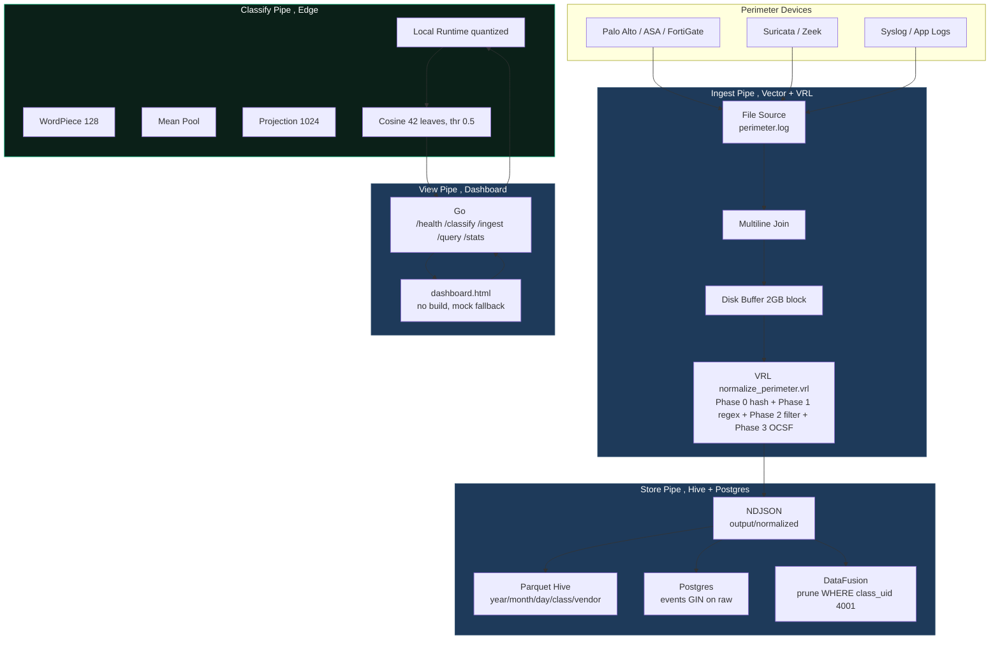
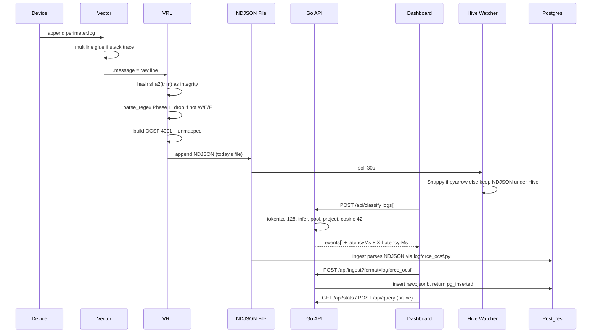
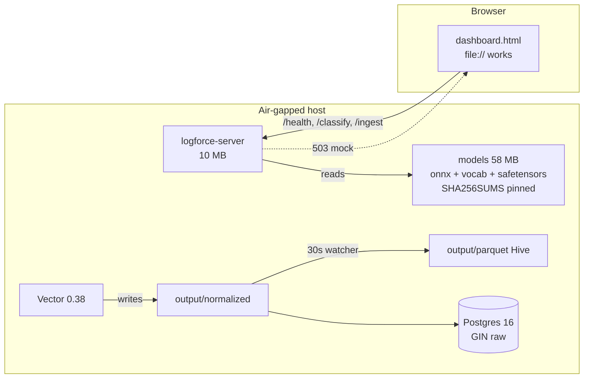

# LogForce Perimeter Prototype ,  System Architecture

Build view, runtime view and deployment view. Each tells a different story about the same code.

## 1. High level ,  modular monolith with clear pipes

We run the prototype as a **modular monolith**. One compose, three pipes:

* **ingest pipe** ,  Vector file source + VRL 4 phases + NDJSON + Hive. Owns raw, hashing and OCSF. No HTTP.
* **classify pipe** ,  Go API + ONNX 23 MB + WordPiece. Owns embedding and leaf cosine. No file I/O beyond models.
* **store pipe** ,  Hive writer + Postgres GIN + bridge `logforce_ocsf.py`. Owns query and decode. No embedding.

Each pipe is a folder, each folder has one public entry point, and no pipe imports another pipe's internals. That is the modular monolith rule from the senior-architect guide. Event-driven and microservices are reserved for the full product (Kafka + sidecars, section 7). The assessor is right that `ui/server.go` at 525 lines is too long for one file ,  the next refactor is `server.go -> api.go + ingest.go + stats.go` sharing a `store` package, but we keep it as one file for the demo so the diff is reviewable.

## 2. Runtime ,  how a line moves

Backpressure is always `block`. Disk buffer 2 GB on the source and `max_events 500` in front of the sink mean spikes stall instead of drop. That matters for forensics ,  losing the head to save the tail is the wrong trade.

## 3. Deployment ,  air-gapped is the default

Images are pinned (`prom/prometheus:v2.51.2` etc. in full stack, `postgres-alpine` here). Models are baked (`Dockerfile.lumber COPY models`), no HF pull at runtime. `docker compose up` is one command. `go run ./ui/server.go` alone also works ,  the dashboard degrades to mock if the model is missing, so the demo never hard-fails.

## 4. Modules ,  why each is shaped this way

| Module | Files | What it does | Why this shape |
|---|---|---|---|
| ui | `ui/dashboard.html`, `ui/server.go`, `ui/go.mod` | One HTML file + Go API. Health warms the ONNX session; classify does one `ClassifyBatch` call; ingest appends NDJSON and PG; stats scans hive; query prunes `WHERE class_uid 4001`. | One binary makes air-gap demos two commands. Keeping HTTP and file ownership together avoids a file-lock split. Will split into `api.go + ingest.go + stats.go` next iteration (assessor's 500-line warning). |
| models | `models/*.onnx`, `2_Dense/*`, `vocab.txt`, `SHA256SUMS` | 23 MB int8 model plus vocab and 1.5 MB projection. Pin avoids silent drift. | Baked into image ,  offline works. Quantized int8 keeps warm at ~5 ms. |
| ingestion | `ingestion/vector.toml`, `transforms/normalize_perimeter.vrl` | Watches `${PERIMETER_LOG_PATH}` with multiline + 2 GB block buffer. VRL Phase 0 hash, Phase 1 single regex, Phase 2 filter, Phase 3 OCSF. | Device logic is one regex. Vector does the rest at Rust speed. |
| parsing | `parsing/logforce_ocsf.py`, `decoders/perimeter.yml` | Fast path for `class_uid 4001` plus 5 Wazuh-style hot-swap decoders. | Both consumers read same NDJSON. No duplicate parse. Hot-swap, no restart. |
| storage | `storage/parquet_writer.py` | Hive `year/month/day/class/vendor` with Snappy or NDJSON fallback. `watch_and_convert` polls 30s. | Hive lets DataFusion prune 90% on `WHERE class_uid 4001`. Fallback keeps air-gap hosts alive without pyarrow. |
| docs | `docs/wiring-vector-to-wazuh.md`, `docs/offline-bundle.md` | Wiring and tar steps. | Small docs next to code beat a wiki when offline. |

## 5. Data store and query choice

Postgres 16 is the right store for this slice: structured data, needs ACID dedup, <1M rows, single node, GIN on `raw` is enough. The senior-architect tech guide says exactly that ,  Postgres is the default under 1M, Timescale/Dynamo only above. Full product later adds ClickHouse for 100M+ burst (same Hive path, different reader).

Writes are cheap: Vector or dashboard `POST /api/ingest` appends NDJSON, then tries `raw::jsonb` insert. Reads prune: `parquet_writer` + DataFusion on Hive for bulk, `GET /api/stats` for KPIs, `POST /api/query` for ad-hoc `WHERE class_uid 4001`.

## 6. How to verify fast

* `GET /api/health` shows `leaves 42`, `threshold 0.5`, `latencyMs` (~389 ms cold, ~5 ms warm).
* `POST /api/classify` three samples: `ERROR.connection_failure ~0.82`, `REQUEST.success ~0.77`, `DEPLOY.build_succeeded ~0.73`.
* `POST /api/ingest?format=logforce_ocsf` with `class_uid 4001` then `GET /api/stats` increments and `vendor logforce` appears.
* Drop a file in `output/normalized`, watch `output/parquet` Hive promotion.
* `python -c "from parsing.logforce_ocsf import parse; list(parse(open('output/normalized/...').read()))"` keeps `raw`.

Coupling is 0/100 and there are no circular deps (dependency analyzer). That is because pipes do not import each other. The remaining smell is file size, not coupling.

## 7. What is not in this prototype ,  full product is event-driven

This folder intentionally lacks Ollama, unknown-solver, and Storm. Those belong to the full product, which is **event-driven + microservices**:

* **ingest:** `Vector file -> Kafka 300 partitions` instead of direct file tail
* **classify:** `HNSW 400 leaves` Hyper ONNX fleet behind gRPC ``, not one Go process
* **devices:** `POST /capture` on WireGuard to pod :8002, not just perimeter file
* **store:** ClickHouse for burst, Postgres for dedup

Prototype proves `raw -> OCSF -> Hive -> query` on one host. Full product shards that same contract.
