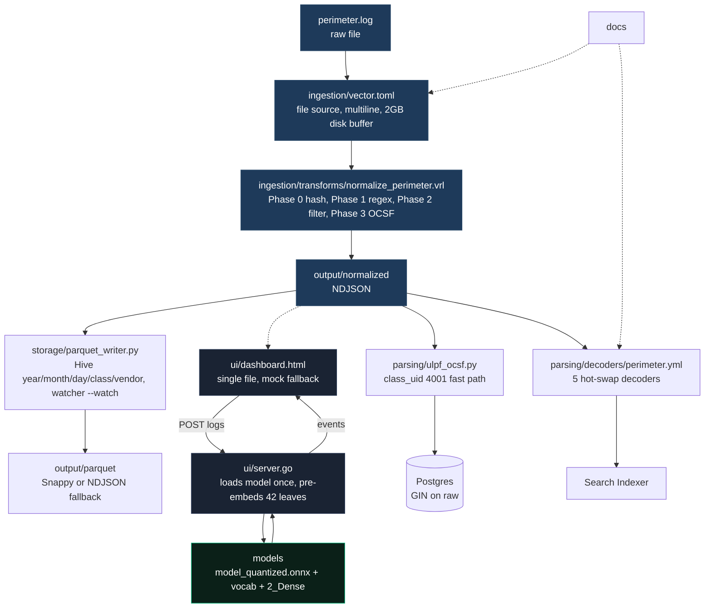

# ULPF Perimeter Prototype — System Design

This doc explains why the prototype is built this way. Read it top to bottom; each section builds on the last.

## 1. What we are solving

Firewalls, IDS, switches and apps each log differently. Syslog, JSON, XML, CSV, CEF, LEEF and hand-rolled text arrive together, with different time formats, severity words and multiline traces. Teams today write one parser per device. The parser breaks when firmware updates. SIEM rules drift because the input was never stable.

We need a pipeline that takes any perimeter log, keeps the raw bytes for forensics, normalizes to one schema, and makes it usable for SIEM and ML. It must run air-gapped, inside a container, and not lose data when the downstream stalls.

## 2. Architecture pattern — why modular monolith for the prototype

We picked **modular monolith** for the prototype, not microservices.

* team is 2-4 people, one deployable unit is simpler
* domain boundaries are still settling (perimeter today, universal tomorrow)
* single `docker compose` is easier to hand to an evaluator than 6 repos
* shared Postgres is fine at this scale

The senior-architect tool flags both `maincode` and this prototype as unstructured (0% pattern confidence) and calls out `ui/server.go:525` as too long. It is right. The fix is not microservices; it is modules inside the monolith that talk only through a public `api/` surface:

```
perimeter/
  ingestion/  -> Vector + VRL, no imports from ui or storage
  ui/         -> dashboard + Go API, owns HTTP, calls ingestion only via file
  parsing/    -> bridge + decoders, no DB imports
  storage/    -> Hive writer, no HTTP
  models/     -> ONNX, read-only
```

That rule is `modules communicate only through public API`. When we need to pull a module out later (say, the classifier to a sidecar), the boundary is already there. Full product later moves to event-driven + microservices (see section 8). Starting with modular monolith keeps the option open without paying the price now.

**ADR-001:** prototype stays modular monolith. Extract services only if a module needs independent scaling or a team needs independent deploys. Neither is true today.

## 3. Hard constraints that shaped the design

* air-gapped, one binary. No HF pull at runtime. The 23 MB quantized model must start in under 500 ms.
* budget is 5 ms per log warm; batch must be one ONNX call for many lines.
* raw never lost. Hash the canonical line, keep the full original under `unmapped`.
* one regex per new device, not one pipeline rewrite.
* `when_full=block`, not drop. `docker compose` brings it all up.

## 4. Folder map — what each folder does



**ui** — dashboard and Go API together. One HTML file works as `file://` with mock and upgrades to real ONNX when `server.go` is on :8081. The server loads the model once, pre-embeds the 42 leaves, and serves `health` and `classify`. Health returns `leaves`, `threshold`, `latencyMs` so the badge can flip. One binary, one port, no build step — that is why air-gap demos are trivial.

The tool says `server.go:525` is too long. We agree. Next split is `server.go -> api.go + ingest.go + stats.go + health.go` with shared `store` package. Not done yet because the prototype is still one file and tests are green; splitting now would churn the demo without changing behavior.

**models** — `model_quantized.onnx` + `onnx_data` (23 MB int8), `vocab.txt` (WordPiece), `2_Dense/model.safetensors` (1.5 MB projection to 1024). `SHA256SUMS` pins them for offline bundles. Empty folder falls back to mock — deliberate fail-safe, not a crash.

**ingestion** — `vector.toml` watches `${PERIMETER_LOG_PATH}` with multiline glue for Java traces and a 2 GB disk buffer that blocks when the VRL or sink stalls. `normalize_perimeter.vrl` has 4 phases: 0 snapshot+hash (SHA-256 over trimmed raw), 1 single regex (the only device-specific line), 2 drop below warning, 3 build OCSF 4001 (`class_uid 4001`, `type_uid 400101`, `integrity`, `unmapped`). New device = one regex, nothing else.

**parsing** — `ulpf_ocsf.py` is the fast path: if `class_uid==4001` unwrap and lift to `NormalizedEvent` while keeping everything in `raw`. `perimeter.yml` adds 5 hot-swap decoders (Palo Alto, ASA, FortiGate, CEF, Suricata) with `prematch` + `regex` + `mapping`. The engine swaps them without restart.

**storage** — `parquet_writer.py` moves NDJSON to Hive `year/month/day/class/vendor` with Snappy if pyarrow is present, otherwise keeps NDJSON under the same hive path so no data is lost. `watch_and_convert` polls every 30s.

## 5. Database choice — why Postgres here

Prototype picks **PostgreSQL 16** for the prototype slice:

* data is structured with clear relationships, needs ACID for dedup (`UNIQUE dedup_hash, event_time` pattern from SIEM-Lite)
* GIN on `raw jsonb` gives SIEM search without Elasticsearch at this scale
* <1M events, single node, read-heavy — Postgres is the default choice per tech guide
* Timescale or ClickHouse would be overkill now, right later

Full product keeps Postgres for `events` but adds **ClickHouse** for 100M+ burst (see section 8). Same Hive path, different engine per query size.

## 6. Component design, briefly

**Edge engine.** WordPiece to 128, run ONNX with 3 tensors, mean-pool, project to 1024, cosine vs 42 pre-embedded leaves, pick best above 0.5 or `UNCLASSIFIED`. Batch packs many texts into one call — that is how 100 lines hit 50–80 ms.

**Vector + VRL.** File source is the simplest air-gap source, no agent needed. VRL runs at Rust speed. Hash over trimmed raw, not normalized event, so replays are stable (`echo -n raw | sha256sum` matches `integrity.hash`).

**Parquet + DataFusion.** Hive + Snappy is the cheapest way to prune by time and vendor. DataFusion registers the parquet root and pushes predicates to file level. Postgres GIN handles `raw` search that Parquet cannot.

## 7. Data shape and contracts

Canonical event from Lumber: `type`, `category`, `severity`, `timestamp`, `summary`, `confidence`, `raw`. OCSF wraps it: `class_uid 4001`, `type_uid 400101`, `severity_id` (F6/E4/W3), `finding {uid, title, type_uid 200401}`, `process {pid, name}`, `metadata {product, log_date, log_time}`, `integrity {hash, canonical, algorithm}`, `unmapped {raw_event}`.

Interfaces: dashboard `POST /api/classify {logs[], verbosity?} -> {events[], latencyMs}` and `GET /api/health` every 30s; search `parse(content) -> Iterator[NormalizedEvent]` claims ULPF NDJSON if `class_uid==4001`; ingest `POST /api/ingest?format=` appends NDJSON + PG + Hive.

## 8. What we left out — and where it goes next

This prototype intentionally skips LLM for unknowns, Storm topology, and full Loki/Prom. Those live in `maincode/` as the full product, which uses **event-driven + microservices**:

* **prototype pattern:** modular monolith, single compose, shared PG, file tail
* **full product pattern:** event-driven (Vector -> Kafka) + microservices (auto-capture :8002, miner :8001, classifier :8081, ollama :11434, lake, Grafana) each scales and deploys on its own. Device agents `POST /capture` over WireGuard to the pod; Kafka 300 partitions feed the Hyper ONNX fleet.

Keeping the bundle small is how the air-gap tar stays under 2 GB.

## 9. How to run

From the prototype root: `go run ./ui/server.go`, open `dashboard.html`, export `PERIMETER_LOG_PATH` / `PERIMETER_SINK_PATH` / `VECTOR_DATA_DIR` and run `vector --config ingestion/vector.toml`, then `python storage/parquet_writer.py --watch`. For search, drop NDJSON and select format `ulpf_ocsf`.

## 10. Ground truth

All claims here match files on disk: `ingestion/vector.toml:96`, `transforms/normalize_perimeter.vrl:110`, `ui/server.go:525` length warning is acknowledged, `parsing/ulpf_ocsf.py:89`, `storage/parquet_writer.py:53`, `init.sql:17` GIN, `models/SHA256SUMS` pins 4 hashes. Prototype is ~84% done; remaining 16% is wiring generated VRL and real Parquet, not missing design.
