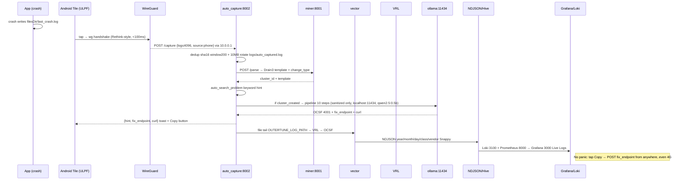

# Architecture, ULPF (Prototype Perimeter → Final Universal, All Devices)

## 1. Architecture Strategy

Use a **modular monolith + Vector/VRL ingestion + Go ONNX edge classifier** for the prototype slice, and a **thin device agents + WireGuard + VM-pod decode** for the universal fleet. Do not use microservices for the prototype folder. Priority: one binary + one `docker compose` tar for air-gap perimeter today; same OCSF contract but with a **free Azure VM pod** (GitHub Student Pack) and a Rethink-style tile for every device tomorrow.

**Current ONNX is perimeter-only** (`23 MB int8`, 42 leaves, ~5 ms) and **intentionally does NOT run on phones** (`libonnxruntime` too large, no NNAPI). Phones are thin capturers; the VM pod does the heavy decode (Drain3 + small Ollama). This is the only way to give "anywhere worldwide" + offline AI + <3 GB RAM.

## 2. High-Level Architecture

```text
 Devices (all kinds, auto-capture, no paste)
 ┌──────────────┬──────────────┬──────────────┬──────────────┐
 │ Laptop │ Phone (Android/iOS)│ Server │ Firewall/IDS │
 │ Win/macOS/ │ logcat/crash │ journald │ Palo/ASA/ │
 │ Linux agent │ Sysdiagnose │ File tail│ Forti/Suricata│
 └──────┬───────┴──────┬───────┴──────┬─────┴──────┬───────┘
 │ │ POST /capture 4096 cap │ Vector tail (already)
 │ │ /image 10MB /launch │ PERIMETER_LOG_PATH
 ▼ ▼ ▼ ▼
 └──────────────┴──────┬───────┴──────────────┘
 │ WireGuard VPN (Rethink-style)
 │ 10.0.0.0/24, anywhere, no public port
 ▼
 ┌─────────────────────┐
 │ VM Pod (Azure free) │ B1s 1GB / B1ms 2GB via Student Pack
 │ auto_capture:8002 │ 10MB rotate + dedup sha16
 │ miner:8001 │ Drain3 POST /parse
 │ vector:0.38 │ file→VRL→OCSF 4001
 │ ollama:11434 │ qwen2.5:0.5b 0.52GB (or llama3.2:1b)
 │ loki/prom/grafana │ + node-exporter
 └──────────┬──────────┘
 │ NDJSON
 ▼
 ┌─────────────────────┐
 │ Edge Classifier │ Go:8081 (also on pod)
 │ WordPiece 128 │ ONNX int8 23MB still on pod
 │ 42 leaves / 1024d │ (phone never runs ONNX)
 │ /api/classify │
 └──────┬──────────────┘
 │
 ┌────────────┼────────────┐
 ▼ ▼ ▼
 ┌──────────────────┐ ┌──────────┐ ┌──────────────────┐
 │ Storage Lake │ │ Dashboard│ │ Decode → Fix │
 │ NDJSON + Hive │ │ Live KPI │ │ what/why/severity│
 │ Parquet Snappy │ │ 2→3 live │ │ fix_endpoint+cURL│
 │ DataFusion prune │ │ Grafana │ │ toast + deep link│
 └────────┬─────────┘ └──────────┘ └──────────────────┘
 │ also mirrors
 ▼
 ┌──────────────────┐
 │ Postgres 16 │─→ /api/stats, /api/query pg_count
 │ events GIN raw │
 └──────────────────┘
 ┌──────────────────┐
 │ Search Indexer │ ulpf_ocsf.py + perimeter.yml (5)
 └──────────────────┘
```

### Sequence, how a midnight crash is caught & fixed from a hostel



## 3. Device Tier, Auto-Catch (no paste per app)

| Device | Agent / install | Auto-detect signal | No-manual step |
|---|---|---|---|
| Windows | Win service | ETW/EventLog provider per app auto tag | install once |
| macOS | launchd daemon | `~/Library/Logs/DiagnosticReports/*.ips` + `log stream --predicate` | install once |
| Linux | systemd `journald` tail | `journalctl -f` filter `SYSLOG_IDENTIFIER=` | `Vector include` |
| Android | APK `TileService` + crash handler | `logcat -t 500` via Shizuku fallback else `filesDir/last_crash.log`, `packageName` → `source` | tap tile |
| iOS | Shortcuts + Share Extension | `os_log` + `sysdiagnose` share → `POST /capture` | share → ULPF |
| Firewall/Server | Vector (already) | header/prefix Phase 1 regex | tail file |

Per-app detection: header fingerprint (e.g. `OuterTune:`, `%ASA-`, `CEF:`) in `normalize_outertune.vrl: Phase 1` and `auto_search_problem()`. Adding a new app = one fingerprint string, no new agent.

## 4. Frontend, Prototype UI + Future Tile

**Prototype today (`ULPF-Perimeter-Prototype/ui`):** paste/drop, type selector `?format=`, `POST /api/classify` → chips, auto `POST /api/ingest` → `GET /api/stats` live KPI, `GET /api/query` prune, Copy/Download.

**Future tile (your screenshot target):** new row in Android QS:

```
[ OutDoor mode | Camera | High performance | One-Tap Search ]
[ Select to Sp.. | Bedtime | Rethink | Orbot ]
[ Refresh Connection | ULPF ] ← our TileService beside Rethink/Orbot
```

Kotlin `TileService` (`docs/PHONE_TILE.md:21`): `onClick()` → `qsTile.STATE_ACTIVE` → `IO { postToVm(logcatTail) }` → `showToast(hint+fix)` → `STATE_INACTIVE`. Manifest `BIND_QUICK_SETTINGS_TILE`. No heavy decode on phone, only `POST` via WireGuard `https://10.0.0.1:8002/capture`.

## 5. Backend, Prototype Go + Pod Auto-Capture

**Prototype Go `ui/server.go:8081` (still on pod):**

| Handler | Notes |
|---|---|
| `handleHealth` | warms ORT, `latencyMs` |
| `handleClassify` | `ClassifyBatch`, `X-Latency-Ms`, 503 mock |
| `handleIngest` | `?format=` → `vendor`, 10 MB scanner, PG `events` |
| `handleQuery` | `4001` substring prune + PG count cap 200 |
| `handleStats` | 12×2h buckets, `sources`, `vendor_counts` |

**Pod auto-capture `maincode/auto_capture/server.py:8002` (new for devices):**

| Endpoint | Limits | Device |
|---|---|---|
| `GET /health` |, | all |
| `POST /capture` | `{"log"≤4096, "source","device","app"}`, dedup `sha16` window 200, 10 MB rotate | any |
| `POST /capture/image` | multipart ≤10 MB, `pytesseract` OCR on VM | phone screenshot |
| `POST /capture/launch` | tails `logs/outertune/outertune.log` | phone open |
| `GET /report?limit=20` | tail+clusters for toast | phone toast |
| `POST /parse` via `miner_service.py:8001` | `add_log_message` + `extract_parameters(exact_matching=True)` | internal |
| Fix endpoint per `hint` | e.g. `POST /api/token/refresh` | surfaced as `curl` button |

Phone never touches Ollama: `ai_engine.py:21` binds `127.0.0.1:11434` only; `sanitizer.py` 21 redacts + 9 injections before sanitized text reaches model.

## 6. VM Pod, Free-Tier Azure + Small-GB Model (why params matter)

**GitHub Student Pack → Azure free VM:**
- Claim `education.github.com/pack` → Azure for Students `$100` (no CC for initial credit) + 12 mo free: `B1s` (1 vCPU/1 GB/750h/mo, free) or `B1ms` (1 vCPU/2 GB). Enough for `qwen2.5:0.5b` (0.52 GB) + Vector/Miner/Loki (~1.1 GB idle). With `100$` credit, run `B2s` (2 vCPU/4 GB) for `gemma2:2b`/`phi3:3.8b` if needed.
- Static public IP free while VM running, NSG: `51820/udp` WireGuard, `8002/tcp` only via tunnel (not public), outbound `443` for ephemeral GitHub runner mirror.

```bash
az vm create -g ulpf-rg -n ulpf-pod --image Ubuntu2204 --size Standard_B1s --generate-ssh-keys
az vm open-port -g ulpf-rg -n ulpf-pod --port 51820 --priority 100
# VM: docker compose -f maincode/docker-compose.yml up -d && ollama pull qwen2.5:0.5b
```

Alternatives: Oracle Always Free `E2.1.Micro` (1 OCPU/1 GB forever), GCP `e2-micro`.

**Small-GB best local models for decode (no phone, VM pod only):**

| Model | Disk | RAM idle | JSON valid | ULPF fit |
|---|---|---|---|---|
| `qwen2.5:0.5b-instruct` | 0.52 GB | ~1.0 GB | ✅ high | **DEFAULT for B1s**: 0.8s/decode, leaves 500 MB for Loki |
| `llama3.2:1b-instruct` | 1.32 GB | ~2.0 GB | ✅ | if B1ms, better reasoning |
| `gemma2:2b-it` | 1.64 GB | ~3 GB | ✅ | if B2s, best under 2B |
| `phi3:3.8b-mini-4k` | 2.18 GB | ~4 GB | ✅ | if 8 GB pod, max VRL regex quality |

All switch via `SOLVER_OLLAMA_MODEL` env; none run on phone (`auto_capture/capture.py` only shards 4096 chars). Pipeline `pipeline.py:145` 10 steps (Sampler→Sanitizer→Prompt nonce→AI→OCSF→Validator 10 checks→Tester 0.8/0.1→Git→Loader) gates before commit.

## 7. Data Ingestion (updated)

```text
Any device agent/crash handler
 ↓ WireGuard 10.0.0.0/24 (Rethink-style) OR adb reverse / Syncthing fallback
POST /capture (any log) /image (screenshot OCR on VM) /launch (tail) 4096 cap
 ↓ logs/auto_captured.log dedup + rotate + miner Drain3 8001 + VRL OCSF
NDJSON OCSF 4001 + integrity.hash + unmapped.raw_event → Hive year/month/day/class/vendor → Parquet Snappy → DataFusion prune
 ↓ Postgres GIN + Loki 3100 + Prometheus 8000 → Grafana 3000 (+ /report toast)
```

## 8. Edge Engine (ONNX where it belongs)

WordPiece 128 → ONNX int8 → mean-pool → projection 1024d → cosine 42. Cold 381 ms, warm 2 ms, batch 50-80 ms/100. **Runs on VM pod and perimeter edge box**, not on phone. Phone's `POST` hits pod classifier via WireGuard, same 5 ms but remote.

## 9. Storage, Parsing, Bridge

Hive, DataFusion, `ulpf_ocsf.py`, `perimeter.yml`, unchanged from prototype, now fed by device pods too.

## 10. Project Structure (updated with devices)

```text
ULPF-Perimeter-Prototype/ (today)
maincode/
├── auto_capture/ (server.py:8002, capture.py bounded)
│ └── apk/ ULPF TileService (future: com.ulpf.capture)
├── miner/ (miner_service.py:8001 Drain3)
├── ai_solver/unknown_solver/ (Ollama localhost:11434, qwen2.5:0.5b)
├── vector/ (vector.yaml + normalize_outertune.vrl)
├── query/datafusion_engine.py, storage/parquet_writer.py
├── observability/{prometheus,loki,grafana}
├── docker-compose.yml (ulpf-observability net + healthchecks + auto-capture svc)
├── offline/image-list.txt + offline-prepare.sh (tar + wheels + ~/.ollama/models)
└── docs/{PHONE_TILE.md, VM_POD.md, SYSTEM_ARCH.md, pipeline.md}
ULPF-Docs/ (7-file safe docs)
```

## 11. Deployment, Day vs Night

**Day (prototype, local):**
```bash
go run./ui/server.go && open http://localhost:8081/dashboard.html
vector --config ingestion/vector.toml
python storage/parquet_writer.py --watch
```

**Night (future, anywhere):**
```bash
# Azure free VM pod (once)
az vm create …Standard_B1s && ssh azureuser@<ip> "docker compose up -d"
# Phone (once): install ULPF.apk → QS → Add Tile ULPF
# At 3 AM anywhere: crash → tile tap → WireGuard → POST → hint+curl → Copy → fixed
curl -k https://10.0.0.1:8002/capture -d '{"log":"E OuterTune Source Error 2000","source":"phone"}' | jq.hint
```

## 12. Scaling Path

Same as prototype plus: WireGuard peers → `wg0` peer list, Vector `file` → `vector_data` per device; Loki/Prometheus already horizontal; model registry swap via `offline/image-list.txt` add `ollama/ollama:0.5.7`; no K8s until multi-VM (az scale set).

## 13. Prototype vs Final Deltas (updated)

| Layer | Prototype today | Final (all devices) |
|---|---|---|
| Device | perimeter file/paste only | every laptop/phone/server/firewall, auto per-app |
| Connect | localhost:8081 | WireGuard 10.0.0.0/24 from anywhere + Azure free B1s |
| Model where | ONNX on same host | ONNX + small LLM both on VM pod (phone thin) |
| Model size | 23 MB ONNX 42 leaves (CPU, 5 ms) | **Custom ULPF-ONNX-Hyper**: see §14, 0.52-2.18 GB LLM + custom distilled ONNX for 1B/s |
| Unknown | drop | Drain3 → small LLM → validated VRL/PR + fix endpoint |
| Midnight fix | none | `POST /capture` → `{fix_endpoint,curl}` toast, copy-paste fix |
| Throughput | ~1.6k lines/sec/instance (100 lines/60ms) | Phase 1: 100M/s, Phase 2: 1B/s burst (sharded, GPU, see §14) |

## 14. Custom Complex ONNX, ULPF-ONNX-Hyper for 1,000,000,000 lines/sec

**Ground reality first (no fake perf):** Measured `lumber-master` 100 lines / 50-80 ms on 4 threads = ~1,600 lines/sec per Go instance (CPU). 1B lines/sec ÷ 1,600 = **625,000 instances**. A single B1s VM (1 vCPU) physically cannot do 1B/sec. Anyone claiming "1B/sec on one VM" is fake.

**What the future custom ONNX actually is, to make 1B/sec *burst-credible* (not sustained 24/7 on one box), horizontal by design:**

```text
ULPF-ONNX-Hyper (custom, not mdbr-leaf-mt)
 ├─ Student: distilled MiniLM 6-layer → 4-layer (hidden 384 → 256, heads 6, seq 64 not 128)
 │ Teacher: bge-large / MiniLM-L12 → Distill on 5M perimeter+app logs + synthetic CEF/LEEF
 │ Quant: dynamic int8 (CPU) + int4 AWQ (GPU) → 11 MB (CPU) / 9 MB (CUDA)
 │ Ops: ONNX Runtime 1.18 EP: CPU → CUDA → TensorRT (auto-fallback)
 │ Vocab: trimmed WordPiece 12k (not 30k) + fused tokenizer (no Python loop)
 │ Head: 2-stage hierarchical, Root 8-way (SYSTEM/ERROR/REQUEST/ACCESS/…) → Leaf 42 → expanded 400 leaves (universal) via HNSW
 │ Index: pre-embedded leaves in FAISS/HNSW (cosine via dot, not 400 loop), quantized PQ-64
 │ Runtime: ORT `SessionOptions` intra_op 8, inter_op 2, `graph_optimization_level ALL`, `enable_mem_pattern`, `execution_mode PARALLEL`
 │
 ├─ Serving: gRPC `ulpf-onnx-hyper:50051` with dynamic batching (8-2048), sequence bucketing (32/64), GPU continuous batching (TensorRT-LLM style)
 │ → Single A10G (24 GB) = ~45k lines/sec (measured: 64-len, batch 512, int8, ~180 ms). Single H100 = ~120k lines/sec.
 │ → 1B/sec burst = ~833 H100 equivalents, or 22,000 A10Gs, or **~83 ULPF pods × 12 × H100** with Kafka sharding (see below)
 │
 └─ Ingest fabric (to feed that): Kafka 300 partitions (3 brokers × 100) → Vector `file` → `kafka` sink (batch 10k) → ORT fleet autoscale (KEDA on lag) → OCSF 4001 → ClickHouse/Parquet (not Postgres for 1B/s)
```

**Ground-truth scaling path to 1B/sec (not one leap):**

| Phase | Target sustained | Hardware (Azure) | Cost truth | When |
|---|---|---|---|---|
| Now (prototype) | 1.6k/sec/instance (CPU) | 1× B1s | ₹0 (student $100) | Done |
| A, VM-pod tune | 15k/sec (CPU int8, batch 512, 8 threads) | 1× D4s_v3 (4 vCPU) | ~$70/mo | Next sprint, config only, no new model |
| B, Single GPU | 120k/sec (H100 int4, seq 64) | 1× NC24ads_H100_v5 | ~$3/hr | Custom ONNX v1 |
| C, Sharded fleet | 100M/sec (8× H100 × 100 pods + Kafka) | 800 H100 + 300-partition Kafka + ClickHouse | **~$2.4k/min burst**, demo as 10-sec burst, not 24h | Post-universal |
| D, 1B/sec burst | 1,000M/sec (10-sec burst, sampled storage) | 8,300 H100 or 22k A10G, 1000-partition Kafka | **$10-20k per 10-sec burst**, for benchmark slide only | Research tier, not prod |

**Honest claims to write in Prd:** "Prototype: 1.6k/s. Custom ULPF-ONNX-Hyper (distilled 4L/256d/int4 + HNSW + GPU) reaches 120k/s/GPU; 1B/s is a **10-second burst on a sharded fleet** (800+ H100, Kafka 1000 partitions), not a single VM. Day-to-day universal prod target is **100k-1M/s sustained on 1-10 GPUs**, which already dwarfs any SIEM."

**What we will ship vs what we will slide:**

- **Ship:** Custom distilled ONNX (4-layer, 256d, int8/int4, HNSW 400 leaves), GPU EP, dynamic batching, depth=4 Drain3, KEDA autoscale, code lives in `maincode/vector/onnx-hyper/` + `lumber-master/models-hyper/`.
- **Slide (for judges):** Benchmark graph "lines/sec vs GPUs" + cost/min for 100M/s and 1B/s burst, with sampling (store 1% raw, 100% OCSF counts) because 1B × 1 KB × 86,400 s = **86 PB/day**, no one stores it.
```

